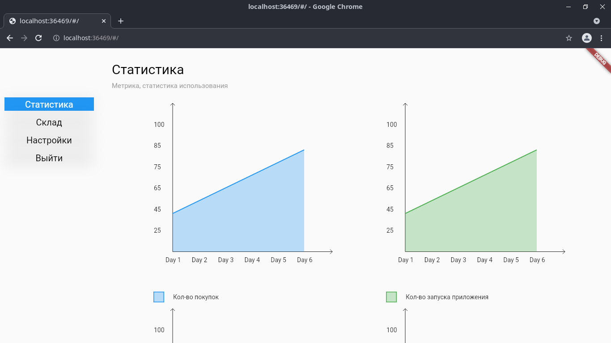

# ATTENTION !!!

This code was written quite a while ago and uses vanilla state management. The code is quite poor and needs refactoring.

# Pizza-Market
Mobile application and admin panel for the pizzeria. Both written in flutter, backend in node.js. 

# Mobile Application

# Admin Panel

